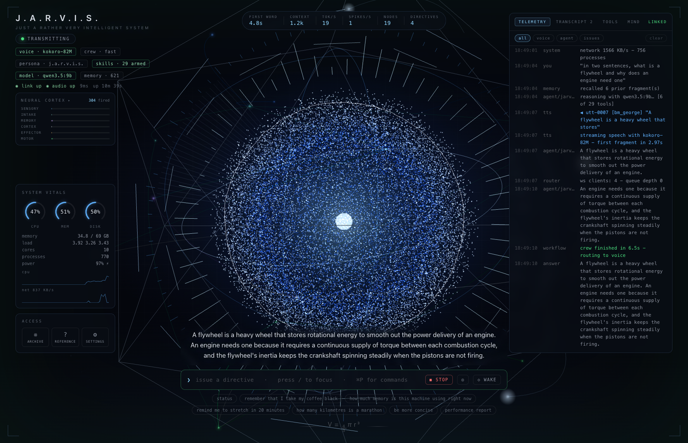
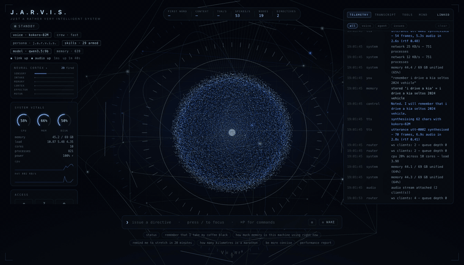
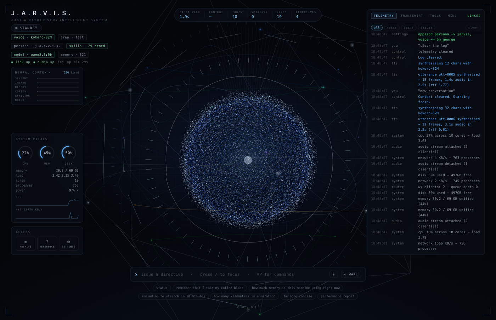
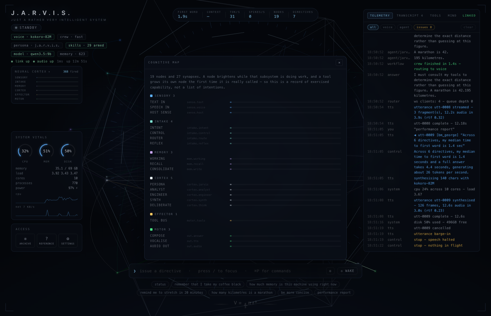
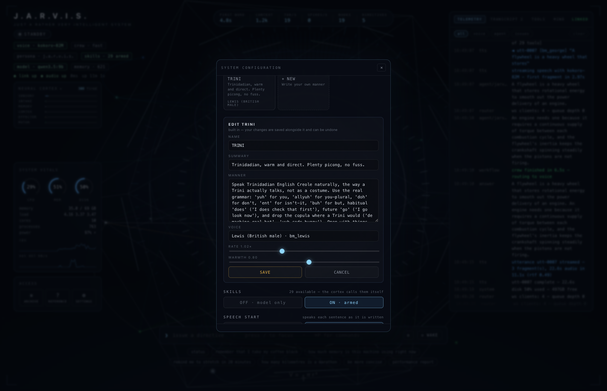
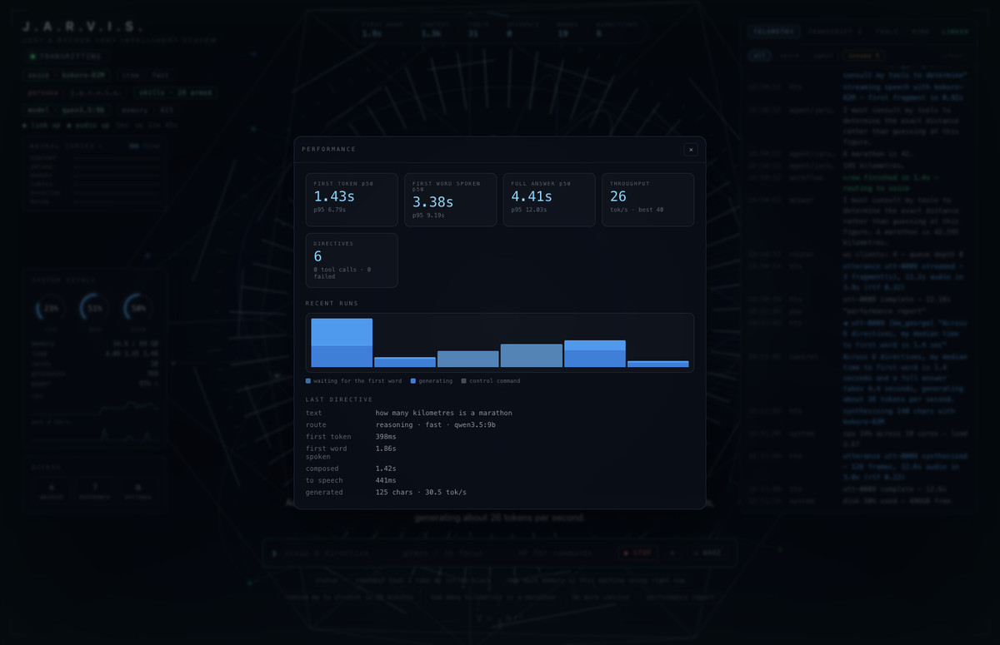
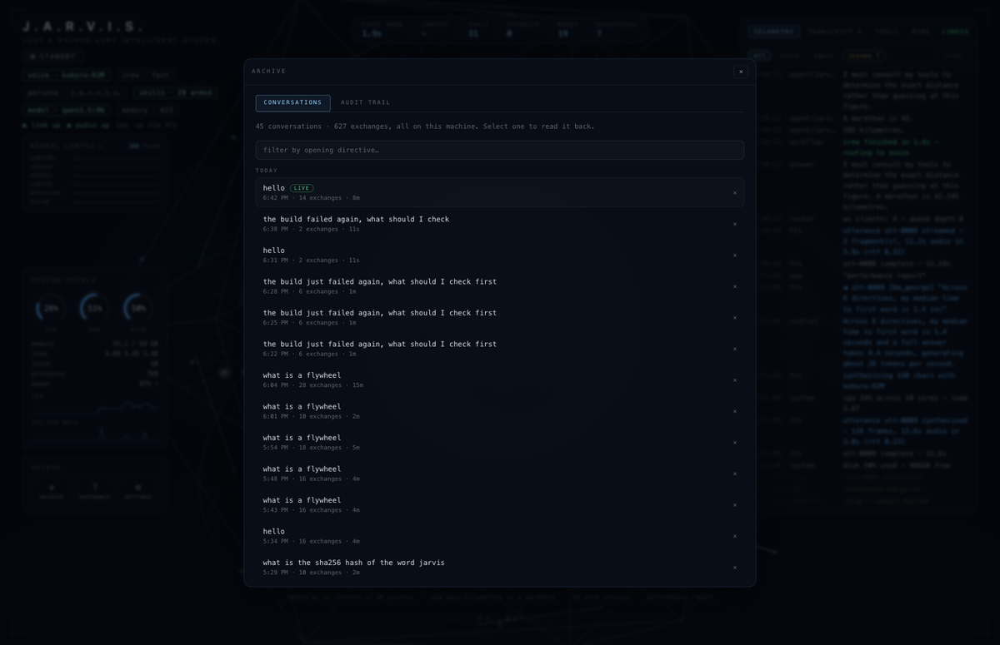
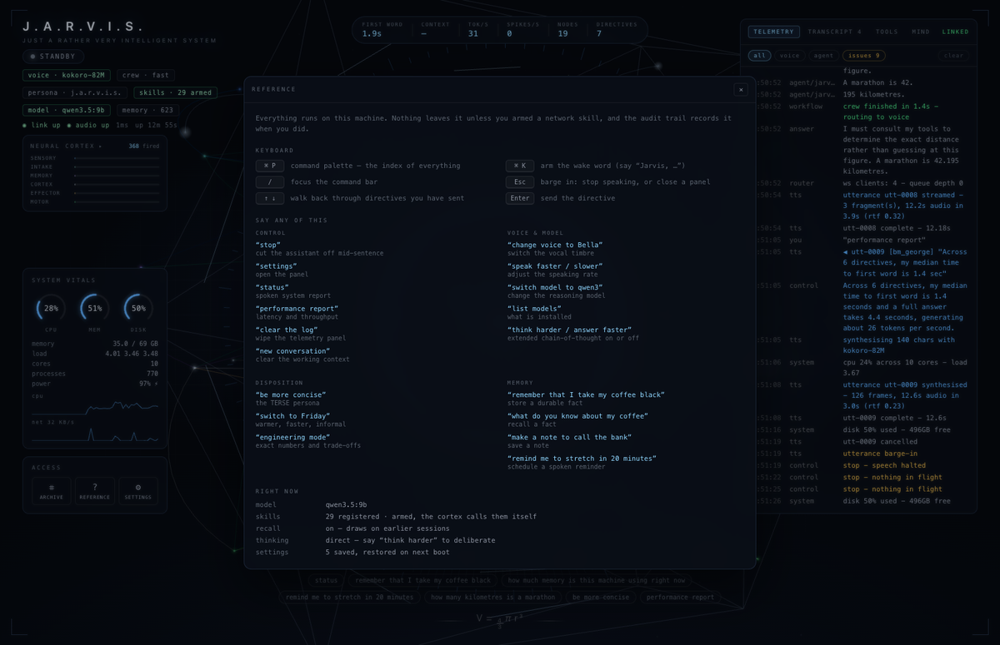
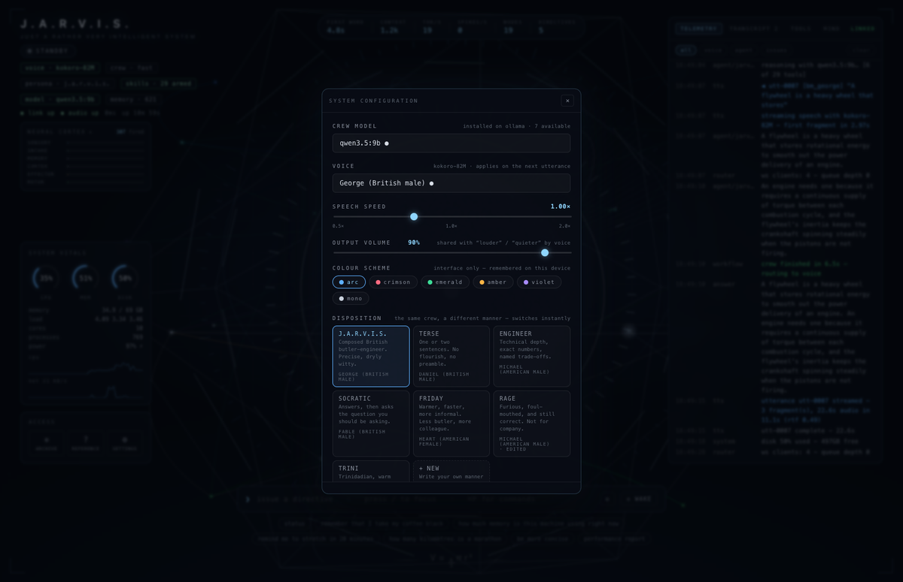

<div align="center">

# J.A.R.V.I.S.

**A locally hosted, voice-first AI assistant with an audio-reactive holographic
interface — running entirely on your own machine.**

No cloud. No API keys. Nothing leaves the laptop.



</div>

---

## It talks back

Type or speak a directive; the answer is spoken as it is written, with the
particle sphere driven by the live speech frequencies. Below, one directive end
to end — the model reasoning, the first sentence reaching the vocal engine
before the answer is finished, and the hologram reacting to the audio actually
playing.

<div align="center">
  
</div>

<div align="center">

**▶ [Watch the full 25-second run](docs/media/demo.mp4)** — three directives
back to back, including the reflex arc grounding a date question before the
model ever sees it.

</div>

---

## What it is

| | |
| --- | --- |
| **Interface** | A wireframe icosahedron around a 24,000-point particle sphere, displaced on the GPU by live speech frequencies — ringed by an FFT spectrum, an oscilloscope, instrument rings and orbiting satellites. Host vitals left, telemetry right, spoken captions along the bottom. |
| **Brain** | Local Ollama models with native tool calling, 29 skills, durable on-device memory, and a deterministic reflex arc for the things a model is confidently wrong about. |
| **Voice** | Kokoro-82M via `pykokoro` (ONNX, Core ML capable), streamed sentence-by-sentence as int16 PCM to the browser — so it starts speaking before it has finished thinking. |
| **Ears** | Browser speech recognition with its own endpointer, acoustic echo cancellation so it never answers its own voice, and true barge-in: talk over it and it stops. |
| **Nervous system** | FastAPI streaming telemetry, real host metrics, neural activation and raw audio over WebSockets. Every subsystem is a node on a cognitive map, and nothing pulses unless that code path actually ran. |

Everything degrades gracefully: with **zero optional dependencies** the full
product loop still runs (simulated crew + dependency-free synth voice), so you
can develop the interface on any machine and switch on the real engines on the
target hardware.

---

## A look around

<table>
<tr>
<td width="50%"></td>
<td width="50%"></td>
</tr>
<tr>
<td><b>At rest.</b> Host vitals and the neural cortex meters on the left, live
telemetry on the right, the command bar below. The core breathes while idle.</td>
<td><b>Cognitive map.</b> 19 nodes and 27 synapses. A node brightens while that
subsystem is working, and a tool grows its own node the first time it is really
called — a record of exercised capability, not a list of intentions.</td>
</tr>
<tr>
<td></td>
<td></td>
</tr>
<tr>
<td><b>Dispositions.</b> Seven ship with it — butler, terse, engineer, socratic,
warm, furious, Trinidadian — each with its own voice. Edit any of them, or write
your own.</td>
<td><b>Performance.</b> p50/p95 time to first spoken word, tokens per second,
and a run history separating <i>waiting</i> from <i>generating</i>. Measured
around real model calls, never estimated.</td>
</tr>
<tr>
<td></td>
<td></td>
</tr>
<tr>
<td><b>Archive.</b> Every past conversation, searchable, plus an audit trail of
every skill this machine has ever run.</td>
<td><b>Reference.</b> Shortcuts and spoken phrases, one keypress away (<code>?</code>).</td>
</tr>
</table>

---

## Quickstart

Requirements: **Python 3.12**, Node 20+.

> ⚠️ **Python 3.12 specifically.** The Kokoro voice stack has no wheels for
> 3.13+ (`kokoro` requires `<3.13`, `kokoro-onnx` requires `<3.14`). On a newer
> interpreter the backend still runs but silently falls back to the robotic
> synth voice. `make setup` pins 3.12 for you (via [uv](https://astral.sh/uv)
> if installed) and fails loudly otherwise.

```bash
make setup          # backend venv (python 3.12) + frontend npm install

make backend        # FastAPI on :8000
make frontend       # Next.js on :3000 (proxies /ws/* and /api/* same-origin)
```

Open **http://localhost:3000**. Boot logs stream into the telemetry panel;
type a directive (or use the mic) and the answer is spoken back with the
particle sphere reacting to the audio in real time.

The first launch downloads the Kokoro weights (~330 MB) into the Hugging Face
cache and warms the ONNX session in the background — the log says
`vocal engine warm in …` when speech is ready.



Everything is live from the settings panel (`⚙` under the vitals, or just say
*"settings"*): model, voice, disposition, skills, memory, speech and render
quality. Models Ollama actually has installed are shown separately from mere
suggestions, because picking an un-pulled tag is the easiest way to end up with
a crew that cannot answer.

---

## Contents

**Making it fast** · [Extended thinking is off](#speed-extended-thinking-is-off-by-default) · [It stops waiting for the recogniser](#speed-it-stops-waiting-for-the-recogniser-to-make-up-its-mind) · [Speaking before it finishes thinking](#speed-the-assistant-speaks-before-it-has-finished-thinking) · [Tools are not free](#tools-are-not-free-and-only-the-relevant-ones-are-attached)

**Getting it right** · [The reflex arc](#the-reflex-arc) · [Two things that must never be approximated](#two-things-that-must-never-be-approximated) · [It does not answer its own voice](#it-does-not-answer-its-own-voice--and-you-can-talk-over-it)

**What it can do** · [Skills](#skills--things-it-can-actually-do) · [Memory](#memory-that-survives-a-restart) · [Dispositions](#dispositions) · [Voice control](#voice-control) · [The neural system](#the-neural-system)

**Running it** · [What runs where](#what-runs-where) · [Enabling the real stack](#enabling-the-real-stack-macos--apple-silicon) · [Configuration](#configuration-env) · [WebSocket protocol](#websocket-protocol)

> Much of what follows is **measured rather than asserted** — timings, token
> counts and tool-call rates from real runs on one machine, with the failures
> that motivated each fix written down next to it. Where a number appears, it
> came from an experiment in this repository.

---

## Making it fast

A voice assistant lives or dies on the gap between you finishing a sentence and
it starting one. Four things were in the way, and each was measured before and
after.

### Speed: extended thinking is off by default

Modern local models (qwen3.x, deepseek-r1, gemma, …) emit a long
chain-of-thought before answering. Measured on this project with `qwen3.5:9b`:

| Extended thinking | Time to a spoken answer |
| --- | --- |
| **off** (default) | **~2.5 s** |
| on | ~95 s |

So it ships **off**, and you opt in when you actually want deliberation —
toggle it in the settings panel, or say *"think harder"* / *"answer faster"*.
When it is on, the reasoning is routed to the telemetry panel as
`agent/thought` lines and never spoken aloud. Set `JARVIS_THINK=1` to default
it on.


### Speed: it stops waiting for the recogniser to make up its mind

Before any of the below matters, there is a second of dead air at the front of
every spoken exchange that has nothing to do with the model: Chrome decides a
phrase is over on its own schedule, and `isFinal` typically lands well over a
second after you stopped talking.

So `frontend/src/hooks/useSpeechRecognition.ts` does its own endpointing.
Interim results arrive continuously; once one has stopped changing for long
enough that the phrase is plainly over, it is dispatched immediately rather
than waiting for the engine to agree. How long "long enough" is depends on the
phrase — a phrase ending on a word nobody pauses after ("…the", "…and") is
given 1.3 s, a one- or two-word phrase 0.95 s, a whole thought 0.6 s — because
the cost of guessing wrong is cutting you off mid-sentence. If the engine's own
verdict then adds a further three words or more, they are treated as a
directive of their own rather than dropped.

### Speed: the assistant speaks before it has finished thinking

The vocal engine is fastest when handed whole sentences — Kokoro synthesises a
sentence in well under half the time it takes to say it (measured median 0.43×
real time across 82 utterances on this machine, best 0.20×). So the answer is not
waited for: `backend/app/tts/segmenter.py` watches the token stream, and the
moment a sentence closes it goes straight to the vocal engine while the model
is still writing the next one. The first fragment is even allowed to break at a
clause, because Kokoro emits no audio until a whole sentence is done and a
35-word opening sentence is several seconds of silence.

If no clause boundary turns up it breaks at a **word** instead, choosing one
that sounds like a breath rather than a stumble — *"…a long-distance running
event / covering a standard distance of…"*, never *"…covering a / standard
distance…"*. That fallback is not a nicety: plenty of perfectly ordinary
answers contain no comma anywhere, and without it those answers were never
streamed at all — the assistant waited out the entire generation before saying
a word, which is the one thing the feature exists to prevent.

How *short* the opening fragment should be is measured, not guessed, because
the answer is counter-intuitive. Kokoro's time to its first sample against the
length of text it is given, median over six sentences on this machine:

| Opening fragment | Time to first sample | Speech returned |
| --- | --- | --- |
| 26 chars | 1.15 s | 1.5 s |
| 30 chars | 1.21 s | 1.9 s |
| **34 chars** | **0.67 s** | **3.0 s** |
| 38 chars | 0.67 s | 3.3 s |
| 46 chars | 0.76 s | 3.8 s |
| 56 chars | 0.91 s | 4.5 s |

There is a cliff just under ~32 characters, below which a shorter fragment is
*slower to speak and shorter when spoken* — the worst of both. So the opening
fragment is pinned to the 34–46 band (`JARVIS_SPEECH_FIRST_MIN_CHARS`,
`JARVIS_SPEECH_FIRST_MAX_CHARS`), where latency is at its floor and the audio
returned still buys three seconds to synthesise everything behind it.

The same floor is why a reply beginning *"Certainly, sir."* does not ship those
fifteen characters as a fragment of their own: it would cost a full second to
produce one second of audio, leaving no time to make what comes next, and the
answer would stall audibly right after the greeting. Short opening sentences
are folded into the one that follows; short sentences *later* in an answer are
fine, because by then there is already speech playing to cover the next pass.

Measured end to end with `qwen3.5:9b` on conversational questions (median
answer ~400 characters), as the time from the directive arriving to the first
word being *heard*. Twenty runs, ten per configuration, alternating on a single
backend so neither side gets the cold machine:

| Opening fragment | Time to the first spoken word |
| --- | --- |
| **word-break, 34–46 chars** (default) | **2.4 s** median, 2.3 s mean |
| clause-only, 40–150 chars (previous) | 3.8 s median, 4.0 s mean |

That is 1.4 s off every spoken exchange, and it understates the change: in the
last run of the new configuration, *every* answer had started being spoken
before the model finished writing it. Under the old thresholds not one had.

The gain grows with answer length, since the opening fragment closes at the
same early moment however long the reply turns out to be. Toggle streaming in
the settings panel under **SPEECH START**, or set `JARVIS_STREAM_SPEECH=0`.

(The recogniser's endpointing above is a further ~0.5–1 s, and is not included
here — it happens in the browser, before the backend has heard anything.)

Two related costs are paid up front rather than on your first directive:

* **Model residency.** Paging an 8B model in costs 2–10 s. The backend preloads
  it at boot and again the instant you switch model (`JARVIS_PRELOAD`), and
  sends `keep_alive` so Ollama holds it for the session
  (`JARVIS_OLLAMA_KEEP_ALIVE`, default `30m`).
* **Vocal warmup.** The ONNX session is built at boot (`JARVIS_TTS_WARMUP`).

The interface reports both figures: **FIRST WORD** in the instrument bar is the
time to the first *spoken* word, not the first generated token — open the
performance view for the p50/p95 of each.


### Two things that must never be approximated

**Audio frames are not telemetry.** The PCM path fans synthesised frames out to
every attached client through bounded queues, and those queues used to make
room by discarding the oldest frame. For log lines that is fine; for audio it
is a hole in the middle of a word, and the operator hears the assistant stutter
with nothing anywhere saying why. Worse, the bounds were counted in *frames*
while the frame size is a tunable — halving it to 100 ms silently halved every
buffer's capacity in seconds, and answers here routinely run past 30. Both
queues now refuse to discard: the per-fragment handoff is unbounded (one
fragment is capped by `speech_max_chars` anyway), and a client that falls
minutes behind is reported as an error rather than quietly served corrupted
audio. Verified by counting frames end to end — 504 frames, no gaps in
sequence, 49.7 s delivered intact.

**Animation phase is integrated, never derived.** The hologram's idle breathing
runs faster while the assistant is thinking. Written as `sin(elapsed × rate)`
that looks continuous only while `rate` holds still: change it and the argument
jumps by `elapsed × Δrate`, which after a few minutes of uptime is hundreds of
radians. The visual appeared to restart the instant an answer landed — exactly
when `thinking` fell back to zero. The phase is now accumulated (`phase += dt ×
rate`), so the rate can move freely and the phase never does: the same
transition moves 0.011 where it used to jump 0.276.

### Render quality adapts to the machine

The hologram is 24,000 GPU-displaced particles at full quality, which not every
machine can sustain — and a scene that drops frames also starves the audio
callback driving it, so the sphere stops reacting to the voice. The tier is
picked from what the device reports, then corrected by the frame rate actually
measured (`frontend/src/state/quality.ts`); it steps down at most once per
session, never oscillating. Override it under **RENDER QUALITY** in the
settings panel — the choice is remembered on that device.

| Tier | Particles | Stars | DPR cap | Antialias |
| --- | --- | --- | --- | --- |
| high | 24,000 | 520 | 2 | yes |
| balanced | 12,000 | 340 | 1.5 | yes |
| low | 5,000 | 160 | 1 | no |


## The neural system

The interface's centrepiece is no longer only audio-reactive — it is
*cognition*-reactive. `backend/app/neural.py` models the running assistant as a
directed graph:

| Region | Nodes | Fires when |
| --- | --- | --- |
| sensory | TEXT IN, SPEECH IN, HOST SENSE | a directive arrives, or vitals are sampled |
| intake | INTENT, CONTROL, ROUTER, REFLEX | the command is classified and grounded |
| memory | WORKING, RECALL, CONSOLIDATE | short-term context, durable recall, persistence |
| cortex | PERSONA, ANALYST, ENGINEER, SYNTH, DELIBERATE | the model actually generating |
| effector | TOOL BUS, plus one node per skill | a skill is invoked |
| motor | COMPOSE, VOCALISE, AUDIO OUT | the answer is composed and spoken |

Every hand-off between stages emits an action potential that travels the
corresponding synapse in the 3D shell, and a node's brightness is its live
activation. **A tool grows its own node the first time it is really called**, so
the graph is a record of exercised capability rather than a catalogue of
intentions.

Activation is coalesced to 20 Hz on the server (a streaming model fires the
cortex thousands of times a second) and lands in a mutable singleton on the
client, so the neural stream never re-renders React or the WebGL tree.

The `NEURAL CORTEX` panel on the left summarises the same activity as six
region meters plus a spike odometer; clicking it opens the **cognitive map** —
every node, named and grouped by region, with its live activation. Both are
painted from their own animation frame straight into the DOM, so twenty
activation frames a second never pass through React.

## Settings survive the restart

Model, voice, speed, persona, skills, recall, volume and speech streaming are
written through to `~/.jarvis/settings.json` the moment you change them, and
restored at boot. Environment variables still win at *first* boot, when there
is nothing saved yet; after that the saved value is authoritative, because it
represents a deliberate act rather than a shell default.

Two things are re-validated rather than trusted: `think` and `tools` are model
*capabilities*, so a preference saved against one model is stood down (with a
log line) if the model loaded now cannot do it. A corrupt or unwritable
settings file costs persistence, never the boot — it degrades to session-only
settings and says so.

`DELETE /api/settings` erases the file; the live session keeps its settings and
the *next* boot falls back to the environment.

## The archive

Every conversation and every skill invocation has been recorded since the
hippocampus was added, but neither had a way in. `⌗` in the telemetry header —
or `⌘P` → *archive* — opens both:

* **Conversations** — each session, newest first, grouped by day and named
  after its opening directive. Search finds a conversation only when you
  already remember a word from it; what people actually remember is *when*.
  Expand one to read it back, or erase it (two clicks, no undo).
* **Audit trail** — every skill that has actually run, with the arguments it
  was called with and how long it took. This thing reads files, writes files
  and, when armed, makes network requests on your machine; a record of that
  which can only be read with `sqlite3` is not a record anybody checks.

## Skills — things it can actually do

When the selected model advertises the `tools` capability, the skill schemas
are attached to every request and the runtime runs the full loop: model →
`tool_calls` → execute locally → feed results back → model.

| Skill | Does |
| --- | --- |
| `get_datetime` | exact local date, time, weekday, timezone |
| `calculate` | precise arithmetic (AST-evaluated, never `eval`) |
| `convert_units` | length, mass, time, volume, data, speed, temperature |
| `text_stats` | words, sentences, reading and speaking time, top terms |
| `pick_random` | fair dice, coins, draws and picks — a model cannot do this itself |
| `days_between` / `shift_date` | calendar arithmetic — leap years, month ends, weekdays |
| `hash_text` | md5 / sha1 / sha256 / sha512 of a string |
| `system_status` | live CPU, memory, disk, network, battery, uptime |
| `list_processes` | what is actually eating this machine's CPU or RAM |
| `remember` / `recall` | durable facts and search across every past session |
| `list_facts` / `forget_fact` | see what is stored, and correct it |
| `take_note` / `list_notes` / `delete_note` | free-form notes |
| `set_reminder` / `list_reminders` / `cancel_reminder` | spoken reminders on a scheduler |
| `list_directory` / `read_file` / `search_files` | the permitted workspace only |
| `search_file_contents` | grep *inside* files — where did I write that? |
| `file_info` | size, age, line count, without reading the whole file |
| `directory_size` | where the disk has gone, largest children first |
| `write_file` / `list_scratch_files` / `delete_scratch_file` | text files, in its own scratch folder only |
| `clipboard_read` / `clipboard_write` | the system clipboard — **off** unless `JARVIS_ALLOW_SHELL=1` |
| `open_path` | open a workspace file or folder — **off** unless `JARVIS_ALLOW_SHELL=1` |
| `run_command` | allow-listed read-only shell — **off** unless `JARVIS_ALLOW_SHELL=1` |
| `web_search` | current results with links — **off** unless `JARVIS_ALLOW_NET=1` |
| `get_weather` | conditions and a 3-day forecast — **off** unless `JARVIS_ALLOW_NET=1` |
| `fetch_url` | readable page text — **off** unless `JARVIS_ALLOW_NET=1` |

29 skills by default; 36 with shell and network enabled. The ones worth
singling out are those the model is *confidently wrong* about without help —
dates, digests and randomness all feel computable and are not.

### Tools are not free, and only the relevant ones are attached

A tool schema is not a capability sitting quietly in reserve — it is text in
the prompt, re-read in full before a single token comes back. Measured here:

| | Prompt | Time to first token |
| --- | --- | --- |
| all 29 skills attached | 4,176 tokens | 3.01 s |
| tools disabled entirely | 632 tokens | 1.69 s |

**1.3 seconds on every directive**, whether a tool is called or not, and it
grows with every skill added. The commonest question — *"what is the capital of
Japan"* — needs no tool at all and was paying the most.

So `SkillKit.schemas(for_text=…)` applies the same cheap deterministic
pre-flight the reflex arc uses: a directive that says nothing about files is
not told about the file tools. A small core (date, arithmetic, recall, remember,
host state, unit conversion, web search) always rides along, clusters are
attached on generous keyword triggers, and anything possessive — *"my project"*
— pulls in files and memory. Measured effect:

| Directive | Tools attached | Prompt |
| --- | --- | --- |
| "what is the capital of Japan" | 6 of 29 | 1,269 |
| "how many days until christmas" | 8 of 29 | 1,907 |
| "how much memory is this machine using" | 15 of 29 | 2,317 |
| "search my files for the proxy config" | 21 of 29 | — |

A stable prompt prefix matters just as much. Ollama reuses its KV cache for the
longest *common prefix*, so anything volatile at the front invalidates
everything behind it — including every tool schema. The system prompt used to
carry the clock to the minute; it now carries the date only, and the exact time
still reaches the model through the reflex arc and `get_datetime`. With the
prefix stable and the tool set consistent between turns, a follow-up question
measured **0.24 s** to first token.

The window itself is now `JARVIS_NUM_CTX=8192`, up from 4,096, because at the
old size a large prompt failed silently in both directions: Ollama drops the
oldest messages to make an over-long prompt fit, so the assistant forgets the
conversation rather than saying it cannot hold it, and an answer that hits the
generation ceiling simply reads as a short one. The runtime now reads the token
accounting off Ollama's final stream frame and warns when a prompt passes 80%
of the window or an answer stops on `length`, and the instrument bar shows
**CONTEXT** — the prompt size behind the last answer — next to the wait it
caused.

Safety posture, in four boundaries:

* **Reads** are confined to `JARVIS_WORKSPACE` (default `~`) with a denylist for
  `.ssh`, `.aws`, `.env`, keychains and friends.
* **Writes** land only in `~/.jarvis/files`, text files only, and the path is
  re-checked *after* resolution so neither `..` nor a planted symlink escapes.
  Nothing the user already had can be overwritten.
* **Shell** is off unless `JARVIS_ALLOW_SHELL=1`, and then only allow-listed
  read-only verbs, argv-form, with a timeout. The clipboard and `open_path`
  sit behind the same flag rather than a second, weaker gate — they spawn a
  process, so they answer to the switch that governs spawning processes.
  `clipboard_read` in particular is worth the opt-in: a clipboard very often
  holds the last password someone copied.
* **Network** is off unless `JARVIS_ALLOW_NET=1`, and then every URL is resolved
  before the request and refused if it points at this machine or a private
  network — otherwise "fetch a URL" reaches the cloud metadata endpoint, the
  Ollama admin API on `:11434`, and everything else that trusts localhost.
  Each redirect hop is re-checked, because a `302` would otherwise walk
  straight past the first check.

Every invocation is audited to the memory store and shown in the archive's
**audit trail**. `make test` asserts each boundary refuses; `make smoke`
asserts the sandbox refuses to escape against a running server.

### The reflex arc

A tool-capable model *decides* whether to call a tool, and that decision is
unreliable exactly where it matters. Measured here on `qwen3.5:9b`, with the
strongest prompt wording tried and the `calculate` schema attached:

| Setting | Called the tool for `48271 × 9912` |
| --- | --- |
| temperature 0.6 | 4 / 6 |
| temperature 0.3 | 2 / 6 |
| temperature 0.1 | 3 / 6 |

Every run where it declined produced a *different* wrong number
(478,464,152 / 478,463,152 / 478,462,352 — the answer is **478,462,152**).
Lowering the temperature did not help, because it is a judgement failure rather
than a sampling one.

Adding more tools does not fix this. With 33 schemas attached, the model
called the right one on **1 of 12** questions that plainly needed one — it
narrated *"I will search your files for that"* and then did not.

So none of it is left to judgement. `backend/app/reflexes.py` is a cheap,
deterministic pre-flight: if a directive plainly depends on something this
machine can compute exactly, it is computed *first* and injected as grounding.
The model still writes the prose; it simply can no longer get the value wrong.

| Reflex | Fires on | Why it has to be deterministic |
| --- | --- | --- |
| arithmetic | numbers longer than two digits | a different wrong number every run |
| live host state | CPU, memory, disk, battery *right now* | unknowable from training data |
| current date and time | "today", "what day" | unknowable from training data |
| **date spans** | "how many days until Christmas" | leap years and month lengths, answered fluently and wrong |
| **digests** | "the sha256 of …" | 64 characters of high-entropy hex nobody can eyeball |

The last two are new, and the digest one earned its place: asked for a SHA-256
before any of this existed, the model produced a plausible hex string that was
pure invention — and on a later run produced the digest of `123456`, a string
common enough in training data to be memorised. Neither is detectable by
reading the answer.

Reflexes are deliberately conservative: `2 + 2`, "tell me about the Roman
empire" and "what *is* a sha256 hash" ground nothing, because noise in the
context window costs latency on every turn.

## Memory that survives a restart

`backend/app/memory.py` is a local SQLite hippocampus at `~/.jarvis/jarvis.db`
(override with `JARVIS_DATA_DIR`):

- **episodic** — every turn, with model, latency and session
- **semantic** — facts you asked it to remember, keyed so corrections overwrite
- **notes** and **reminders** — the reminder scheduler speaks them when due,
  waiting for a gap rather than talking over an utterance in flight
- **recall** — keyword-ranked over FTS5 where available, a scored scan otherwise

Relevant fragments are injected ahead of each directive. Two details matter,
and the second was learned the hard way.

The turn being answered is excluded from its own recall — otherwise the
assistant "remembers" the question it was asked one second ago and dutifully
reports it back.

And **automatic recall reads the operator's turns only, never its own.** The
original design injected both sides and framed them in the prompt as "a record
of what was said, not a source of truth". That caveat did not hold. Asked for a
SHA-256 digest before the `hash_text` skill existed, the model invented a
plausible hex string; the invention was persisted like any other turn; recall
then served it back on every later asking as established context, and the model
stopped calling the tool that would have got it right. Measured on
`qwen3.5:9b`, the tool-call rate on exactly those questions went to **0 out of
12** — the assistant had learned its own hallucination and was defending it.

An answer of the assistant's is not evidence of anything; it is an unverified
generation, and there is no prompt wording that reliably makes a model discount
its own past confidence. So the fix is structural rather than textual: the
operator's words are ground truth about their world and are recalled, the
assistant's are not and are not. Nothing is lost — the `recall` **skill** still
searches every turn including its own, so *"what did you tell me earlier"*
works exactly as before. The difference is that it is now asked for rather than
fed in.

The `MIND` tab browses all of it, and searches every past session. Nothing
leaves the machine; `DELETE /api/memory` (or "forget everything you know about
me") erases it.

### The working context manages itself

Persisting is already automatic — every turn goes to SQLite as it happens, so
nothing is ever lost by clearing the *working* context. What needed managing
was the context the model re-reads on every turn, because that is what the
operator feels as latency.

- **Capped by size, not turn count.** Eight turns of "yes" and eight turns of a
  three-hundred-word explanation are the same *number* and wildly different
  prompts. The cap is now a token budget — `num_ctx` minus the measured cost of
  the attached tool schemas minus `JARVIS_CONTEXT_RESERVE_TOKENS` — and the
  oldest turns are dropped to fit, with a line in the telemetry log saying so.
- **Released when it goes stale.** A conversation nobody has touched for
  `JARVIS_CONTEXT_IDLE_RESET_S` (default 15 minutes) is over; the next
  directive starts fresh rather than paying to re-read yesterday.
- **Cleared on demand.** Say *"new conversation"*, or pick it from the command
  palette (`⌘P` → New conversation). Only the working context goes; the durable
  store is untouched.

The **CONTEXT** readout in the instrument bar shows how many prompt tokens the
last answer actually cost, so a slow reply has a visible cause rather than a
mysterious one.

## Dispositions

The same crew, a different manner — **and a different voice**. The factual half
of the system prompt — operator, date, host, spoken-output constraints — is
fixed, so switching personality can never cost the model its grounding.

| Disposition | Manner | Voice |
| --- | --- | --- |
| `J.A.R.V.I.S.` | composed British butler-engineer | bm_george |
| `TERSE` | one or two sentences, no flourish | bm_daniel, 1.08× |
| `ENGINEER` | exact numbers, named trade-offs | am_michael |
| `SOCRATIC` | answers, then asks the better question | bm_fable |
| `FRIDAY` | warm, quick, informal | af_heart, 1.05× |
| `RAGE` | furious and foul-mouthed, still correct | am_fenrir, 1.12× |
| `TRINI` | Trinidadian Creole, warm and direct | bm_lewis, 1.02× |

Selecting a disposition adopts its voice and speech rate; naming a voice in the
same breath still wins, and changing the voice on its own leaves the
disposition alone. Say *"be angry"*, *"trini mode"*, *"switch to rage"*.

Two things had to be got right for this to work at all:

**Switching sheds the previous voice from the context.** The persona lives in
the system prompt, but the conversation behind it still held several turns
spoken in the *old* manner — and a model imitates its own recent output far
more readily than it follows an instruction. Switching back to the butler after
a few furious turns produced a butler who told the operator to pull themselves
together. The assistant's own replies are now dropped on a disposition change;
the operator's turns stay, so the thread survives and only the delivery is
forgotten. Same principle as durable recall: our past output is not evidence.

**Dialect needs examples, not grammar rules.** `TRINI` described with rules
alone ("habitual *does*, drop the copula, 'yuh' for you") produced generic
American with two Trinidadian words bolted on — *"it's getting old checking",
"we gotta be smart"*. Three example sentences in the finished register fixed
it: *"Aye, de build fail again? Check de compiler output first, dat is where de
real error hiding. Steups, yuh think it fix itself jus by yelling at it?"* The
examples are deliberately on unrelated topics so they anchor the register
without being copied wholesale.

Kokoro ships no Caribbean voice, so `TRINI` uses a British base and the accent
lives entirely in the words. `RAGE` has no angry register available either — a
harder male voice slightly above natural pace is as close as the engine gets.

### Write your own

The seven above ship with the assistant; the settings panel edits any of them
and adds your own. Hover a disposition for the ✎, or press **+ NEW**. A
disposition is a name, a one-line summary, the **manner** (the prompt written to
the model in the second person), a voice, a speech rate and a warmth
(temperature).

Yours live in `~/.jarvis/personas.json` and are layered over the built-ins at
boot, so they survive a restart and a saved `persona` preference naming one
resolves on the very first boot. Three rules make that layer safe:

- **A built-in is edited in place, never replaced.** It keeps its key, so every
  saved preference and spoken phrase that names it still resolves. Edits show as
  `· edited` and the button says **RESET TO DEFAULT** rather than delete —
  resetting drops your layer and the shipped text comes back exactly.
- **Only your own can be deleted.** An untouched built-in refuses, because
  something may still be pointing at it.
- **A broken file costs you the file, not the assistant.** Invalid JSON is
  reported in the telemetry log and the built-ins carry on alone; one malformed
  entry is skipped without taking the rest of your dispositions with it.

Editing the disposition that is *currently selected* re-applies it immediately,
voice and rate included — otherwise you would change the manner, hear the old
one, and reasonably conclude it had not saved. `POST /api/personas` and
`DELETE /api/personas/{key}` are the same surface if you would rather script it.

One thing worth knowing when writing the **manner**: examples beat rules. See
how `TRINI` had to be written.

| Persona | Manner |
| --- | --- |
| `jarvis` | composed British butler-engineer, dryly witty |
| `concise` | at most two sentences, no preamble |
| `engineer` | exact numbers, named trade-offs, stated confidence |
| `socratic` | answers, then asks the question you had not considered |
| `friday` | warmer, faster, more informal |

Say *"be more concise"*, *"engineering mode"*, *"switch persona to Friday"*.

## Instruments

The top bar reports what the assistant actually costs: time to first spoken
word, tokens/second, spike rate, node count, directives handled. Click it for
the full view — p50/p95 latency, a run history where each bar separates *waiting
for the first word* from *generating*, and the last directive's full timing
breakdown including which tools it used.

All of it is measured around real model calls, not estimated.

## Voice control

Say (mic button) or type any of these — handled directly, before the crew:

| Voice command | Effect |
| --- | --- |
| `settings` | Opens the settings panel and speaks the current configuration |
| `status` | Speaks engine, model, and thinking state |
| `list models` / `list voices` | Enumerates what is actually installed |
| `switch model to qwen3 8b` | Live-switches the crew model (spoken tag form → `qwen3:8b`) |
| `change voice to af heart` | Hot-swaps the Kokoro voice (and its language) |
| `speak faster` / `set speed to 1.2` | Adjusts speech rate (0.5–2.0×) |
| `think harder` / `answer faster` | Enables / disables extended thinking |
| `stop` | Barge-in — cuts off speech *and* the model still writing it |
| `new conversation` | Clears short-term memory |
| `what time is it` / `what's the date` | Answered locally, no model call |
| `clear the log`, `repeat that`, `who are you`, `help` | As they read |
| `be more concise` / `engineering mode` / `switch persona to Friday` | Switches disposition |
| `remember that my sister is called Ada` | Stores a durable fact |
| `what do you know about the deploy script` | Searches every past session |
| `make a note: rewire the proxy` / `list my notes` | Notes |
| `remind me to stretch in 20 minutes` / `list my reminders` | Spoken reminders |
| `what do you remember` | Memory statistics |
| `list skills` / `enable tools` / `disable tools` | The skill kit |
| `performance report` | Measured latency and throughput |
| `louder` / `quieter` / `set volume to 70` / `mute` | Output gain |
| `use the full crew` / `fast mode` | Single pass vs. four-persona pipeline |
| `forget everything you know about me` | Erases the long-term store |

Control phrases are **anchored**: an ordinary question like *"how do I make
this loop run faster?"* goes to the model rather than being swallowed as a
speech-rate command.

You do not have to say `stop` to interrupt, though — see
[It does not answer its own voice](#it-does-not-answer-its-own-voice--and-you-can-talk-over-it).
Simply talking over the assistant does the same thing.

### Keyboard

| Key | Action |
| --- | --- |
| `/` | Focus the command bar |
| `⌘P` / `Ctrl+P` | Command palette — every capability, fuzzy-searchable |
| `⌘P` → `theme` | Six colour schemes; the WebGL scene cross-fades with the panels |
| `?` | Reference card — shortcuts, phrases and what is armed right now |
| `Esc` | Barge-in — stop speaking, or close a panel |
| `⌘K` / `Ctrl+K` | Toggle wake-word listening |
| `↑` / `↓` | Command history |

The palette is the readable index of the same surface the voice commands reach:
control phrases, dispositions, installed models, voices, colour schemes and
every registered skill. Skills with no required arguments run directly from it;
everything else dispatches the natural-language directive, so the backend's
intent grammar stays the single source of truth for what a command means.

### Wake word

Click **WAKE** (or `⌘K`) for continuous listening: J.A.R.V.I.S. ignores the
room until it hears *"Jarvis, …"*.

### It does not answer its own voice — and you can talk over it

On speakers the microphone hears J.A.R.V.I.S. as well as you, and a recogniser
transcribes both. Answering that transcript is a conversation with no exit.
Timing alone cannot settle it: Chrome finalises a phrase a second or more after
the sound that produced it, by which point the utterance it echoed has often
stopped playing, so a *"is audio playing right now"* check waves every echo
through.

Three defences, in order of how much they actually know:

1. **Acoustic.** Alongside the recogniser, the interface opens its own capture
   stream with the browser's echo canceller enabled
   (`frontend/src/audio/mic.ts`). That canceller is fed whatever the page
   renders, which is exactly the TTS playback, so it subtracts the assistant's
   voice. Energy left in *that* stream while the assistant is talking means a
   person is talking. Nothing captured is played back, sent anywhere or kept —
   only its loudness is read.
2. **Timing.** Every phrase is stamped with when its first audio was *heard*,
   not when the transcript arrived, and checked against when the speakers were
   last making sound.
3. **Content.** A transcript made almost entirely of words just spoken aloud is
   dropped — headphones unplugged mid-answer, echo cancellation unavailable, a
   second machine in the room. Enforced on both sides
   (`frontend/src/lib/echo.ts`, `backend/app/echoguard.py`), and deliberately
   the *weakest* of the three, because content cannot tell you repeating a
   suggestion back (*"open the settings panel"*) from the assistant being
   overheard saying it. So it only fires when the microphone heard nobody
   speak, and a directive the interface has acoustic grounds to trust is
   marked as such on the wire so the backend's content check stands down.
   Short directives like *"stop"* are never judged on content at all, since
   they share vocabulary with any answer.

Because the first of those can tell you from the speakers, **you can simply
talk over the assistant.** That cuts the utterance off *and* aborts the model
still writing it, so your next directive is answered instead of queueing behind
an answer nobody will hear. Set `JARVIS_BARGE_IN=0` to disable.

The reaction is in two stages, because waiting for a transcript before doing
anything means being talked over for the second the recogniser takes to decide.
The instant the room gets loud the answer **ducks to a murmur**; only when a
transcript confirms a person actually spoke does it stop. A cough costs you a
brief dip in volume rather than the answer.

### End-to-end check

```bash
make test           # pure-logic checks - no server, no model, no audio device
make smoke          # health, vitals, settings, intents, barge-in, real audio
```

`make test` covers the parts of the speech path that fail *silently*.

The **segmenter**, because a bad split does not raise — it just makes the
assistant say "Dr" and then, half a second later, "Stark is in the lab". The
checks feed it the same text at chunk sizes from one character to the whole
string and assert nothing is lost, duplicated, or split inside an abbreviation,
a decimal, or a URL — and that an answer containing no comma anywhere still
starts speaking before it has finished being written.

The **echo guard** and **barge-in**, because both fail invisibly in opposite
directions: too loose and the assistant holds a conversation with itself, too
tight and it stops hearing you. So both directions are asserted — that a
fragment of what was just said is refused, and that a follow-up on the same
subject, a correction, and a one-word "stop" all get through.

`smoke` asserts the audio stream is actually **audible** (non-trivial duration
and peak amplitude) rather than merely present, so a silent regression fails
instead of passing quietly. Add `--wav out.wav` to keep the sample and judge
the voice by ear.

It also checks the parts that are easy to break silently: that the cognitive
graph is fully connected with no orphan nodes, that the file skills genuinely
refuse to escape the workspace or read credentials, that a stored fact survives
a round-trip through recall, and that the reflex arc grounds large arithmetic
exactly while staying silent on questions with nothing to compute. Memory
probes clean up after themselves, so running it does not pollute your store.

## Screenshots and the demo loop

Everything in `docs/media/` was captured from this repository actually running —
headless Chrome driven over the DevTools protocol against the live backend, with
`--use-angle=metal` so the WebGL hologram renders rather than coming out blank.
The numbers visible in the telemetry and instrument panels are real readings from
those runs, not mock-ups. On a real GPU it looks better than this.

`demo.mp4` is the fuller run (1100 px, 25 s, three directives); `demo.gif` is the
first of them, kept short because GitHub renders a GIF inline and a video only as
a link.

## What runs where

| Subsystem | Location | Notes |
| --- | --- | --- |
| Neural shell | `frontend/src/components/NeuralMesh.tsx` | Layered barrel of somas, bezier synapses and travelling action potentials, rebuilt when the topology grows |
| Cognitive graph | `backend/app/neural.py`, `frontend/src/state/neural.ts` | Node/edge model of the running assistant; 20 Hz coalesced activation |
| Cortex map | `frontend/src/components/CortexPanel.tsx` | Region + per-node meters, painted from rAF with zero React renders |
| Skills | `backend/app/skills.py` | Sandboxed tool kit with JSON schemas for native tool calling |
| Reflex arc | `backend/app/reflexes.py` | Deterministic grounding that fires before the cortex |
| Long-term memory | `backend/app/memory.py` | SQLite episodic/semantic store, FTS5 recall, notes, reminders |
| Instrumentation | `backend/app/metrics.py`, `frontend/src/components/Instruments.tsx` | Real timings around real model calls |
| Dispositions | `backend/app/personas.py` | Five personalities over one fixed factual prompt |
| Command palette | `frontend/src/components/CommandPalette.tsx` | ⌘P index of every capability |
| Colour schemes | `frontend/src/state/theme.ts` | Four palettes, shared by the CSS and the WebGL scene |
| Holographic scene | `frontend/src/components/Scene.tsx` | R3F canvas: GPU-displaced 24k-point core (`ShaderMaterial`), 64-band FFT bars, 128-point waveform ring, tick-marked HUD rings, gyroscope rings, radar sweep, satellites with trails |
| State | `frontend/src/state/jarvis.ts` | Zustand for DOM HUD only; audio levels flow through a mutable singleton so log traffic never re-renders the canvas |
| Web Audio | `frontend/src/audio/engine.ts` | Gapless PCM scheduling, analyser (bands + waveform + transient kick), barge-in flush, autoplay-state tracking, the window in which the speakers were audible, integrated idle phase |
| Echo cancellation | `frontend/src/audio/mic.ts` | A second capture stream with the browser's echo canceller on, read only as a loudness meter — how the interface tells the operator's voice from its own |
| Sockets | `frontend/src/hooks/useJarvisConnection.ts` | `/ws/logs` (telemetry + commands), `/ws/audio` (TTS chunks), auto-reconnect |
| Panel launcher | `frontend/src/components/AccessPanel.tsx` | Archive, reference and settings as labelled buttons under the vitals |
| Speech input | `frontend/src/hooks/useSpeechRecognition.ts` | Push-to-talk + continuous wake-word mode with auto-restart, and its own endpointer so a phrase dispatches when it ends rather than when Chrome gets round to saying so |
| Echo guard | `frontend/src/lib/echo.ts`, `backend/app/echoguard.py` | Does this transcript consist of words we just said out loud? |
| Vitals | `backend/app/vitals.py`, `frontend/src/components/VitalsPanel.tsx` | Real psutil metrics → arc gauges + sparklines |
| Settings | `backend/app/registry.py`, `frontend/src/components/SettingsPanel.tsx` | Live model/voice/speed/thinking registry; `GET/POST /api/settings` |
| Same-origin proxy | `frontend/server.mjs` | Custom Next.js server proxying `/ws/*` + `/api/*` — no cross-origin calls |
| API layer | `backend/app/main.py` | FastAPI, REST + two bidirectional WebSockets |
| Telemetry bus | `backend/app/logbus.py`, `telemetry.py` | Thread-safe async fan-out; heartbeats derived from real metrics |
| Vocal engine | `backend/app/tts/` | `kokoro_engine.py` (pykokoro → kokoro), `fallback_engine.py`, `manager.py` (threaded streaming, playback gating, barge-in, the window of what was recently spoken) |
| Agent runtime | `backend/app/agents/`, `orchestrator.py` | Ollama probe → fast/crew/crewai runtimes, `<think>` filtering, conversational memory |
| Automation | `backend/tools/mcp_server.py`, `deploy/n8n/` | FastMCP allow-listed tool server + n8n compose & starter workflow |
| Desktop wrapper | `frontend/src-tauri/` | Tauri 2 scaffold for a native macOS shell |

## Enabling the real stack (macOS / Apple Silicon)

The backend auto-detects each layer at startup and logs what it chose.

### 1. Local LLMs — Ollama

```bash
brew install ollama && ollama serve
ollama pull qwen3:8b            # any tag works
```

With Ollama reachable at `127.0.0.1:11434` the crew runs live. If
`JARVIS_OLLAMA_MODEL` is unset (or names a model you have not pulled), the
backend **auto-selects an installed model**, preferring small-and-fast ones,
and says so in the log. The settings panel separates *Installed* from
*Not installed* so you cannot silently pick a model that cannot answer.

Modes (`JARVIS_CREW_MODE`):

- `fast` (default) — one streamed call in the J.A.R.V.I.S. persona with
  short-term memory. Conversational latency.
- `crew` — the four-persona pipeline (Router → Analyst → Engineer →
  Synthesiser), each step streamed to the telemetry panel.
- `JARVIS_USE_CREWAI=1` — the same crew built with the real `crewai` package.

### 2. Natural speech — Kokoro-82M

```bash
pip install 'pykokoro[coreml]'   # ONNX, no torch; Core ML capable
```

Selection order: `pykokoro` → `kokoro` → built-in fallback synth.

```bash
JARVIS_TTS_DEVICE=coreml JARVIS_TTS_QUALITY=fp32 ./run.sh
```

Measured on an M1 Max (24 kHz, per sentence):

| Provider | Quality | Real-time factor | First sentence |
| --- | --- | --- | --- |
| cpu | fp32 | 0.43 | 1.3 s |
| coreml | fp32 | 0.48 | 1.7 s |
| cpu | q8 | 1.04 | 3.6 s |

`fp32` is **~2.4× faster than `q8`** here despite the larger download, so it is
the default. Core ML keeps the work off the GPU so Metal stays free for Ollama
inference; plain `cpu` is marginally faster in wall-clock terms — pick per your
workload. Speech is synthesised **sentence by sentence**, so the first sentence
starts playing while the rest is still being generated.

Voice is configurable: `JARVIS_TTS_VOICE=bm_george` (British male, the JARVIS
register). Switching voice also switches the G2P language automatically —
`af_*` → en-US, `bm_*` → en-GB, and so on.

### 3. Automation — FastMCP + n8n

```bash
make mcp        # stdio FastMCP tool server: exec_command / run_script / speak
make n8n        # n8n on http://localhost:5678 with the voice-bridge workflow
```

Agents' tool calls land on the MCP server (allow-listed commands, audited to
`/tmp/jarvis_mcp_audit.log`); n8n workflows call back via `POST /api/speak` and
`POST /api/command`.

### 4. Native macOS app

See `frontend/src-tauri/README.md`.

## WebSocket protocol

`/ws/logs` — client sends `{"type":"command","text":…,"origin":"text|voice"}`,
`{"type":"stop"}`, `{"type":"ping","ts":…}`, `{"type":"settings",…}` (a settings
delta) or `{"type":"skill","name":…,"arguments":{…}}`; server sends:

| Frame | Meaning |
| --- | --- |
| `hello` | Name, version, engines, settings snapshot, first vitals |
| `log` | `{level: info\|voice\|success\|warn\|error, source, msg}` → gray / blue / green / amber / red |
| `status` | `thinking \| speaking \| idle` |
| `vitals` | Live host metrics (cpu, mem, disk, net, load, battery) |
| `answer.start` / `answer.delta` / `answer` | The reply, streamed token-by-token for the caption |
| `transcript` | A completed conversational turn |
| `settings.update` | After any model / voice / speed / thinking change |
| `ui` | `open_settings`, `close_settings`, `clear_logs`, `clear_transcript` |
| `neural.graph` | The cognitive graph: nodes + edges. Re-sent when a tool node grows |
| `neural` | Coalesced activation at 20 Hz: spikes, edge flows, per-node levels, region peaks |
| `metrics` | Rolling latency / throughput window after every directive |
| `tool` | One executed skill: name, arguments, result, duration |
| `reminder` / `reminder.set` | A reminder fired, or was scheduled |
| `model.pull` | Progress of a model download started from the interface |
| `memory.changed` | Something in the durable store was erased — open archives reload |

`/ws/audio` — server sends `tts.start` (engine, voice, sample_rate, text),
`tts.chunk` (base64 int16 LE PCM, ~200 ms frames), `tts.end`, `tts.flush`
(barge-in) and `tts.error`; client may send `{"type":"speak","text":…}` or
`{"type":"stop"}`. It is a **broadcast** bus — always match on `utterance_id`.

## Configuration (env)

These are **first-boot** defaults. Anything you change from the interface is
saved to `~/.jarvis/settings.json` and wins on every subsequent boot — see
[Settings survive the restart](#settings-survive-the-restart). `DELETE
/api/settings` erases the file and hands control back to the environment.

| Variable | Default | Purpose |
| --- | --- | --- |
| `JARVIS_OLLAMA_BASE_URL` | `http://127.0.0.1:11434` | Ollama endpoint |
| `JARVIS_OLLAMA_MODEL` | *(auto-select)* | Crew model |
| `JARVIS_CREW_MODE` | `fast` | `fast` / `crew` |
| `JARVIS_THINK` | `false` | Extended chain-of-thought |
| `JARVIS_MEMORY_TURNS` | `8` | Conversational turns retained in context (a token budget also applies) |
| `JARVIS_CONTEXT_IDLE_RESET_S` | `900` | Start a fresh context after this much silence (`0` disables) |
| `JARVIS_CONTEXT_RESERVE_TOKENS` | `900` | Headroom kept free for the answer and per-turn grounding |
| `JARVIS_PERSONA` | `jarvis` | Disposition preset |
| `JARVIS_TOOLS` | `true` | Let the cortex call skills natively |
| `JARVIS_TOOL_ROUNDS` | `4` | Model→tool→model round-trips per directive |
| `JARVIS_OLLAMA_KEEP_ALIVE` | `30m` | How long Ollama holds the model in memory |
| `JARVIS_PRELOAD` | `true` | Page the model in at boot and on every model switch |
| `JARVIS_NUM_CTX` | `8192` | Context window sent to Ollama (`0` = server default) — tool schemas alone cost ~3,200 |
| `JARVIS_NUM_PREDICT` | `512` | Ceiling on generated tokens per answer |
| `JARVIS_OLLAMA_RETRIES` | `2` | Retries for a transient transport failure |
| `JARVIS_RECALL` | `true` | Inject fragments of past sessions |
| `JARVIS_RECALL_LIMIT` | `4` | Fragments injected per directive |
| `JARVIS_PERSIST` | `true` | Write every turn to the on-disk store |
| `JARVIS_DATA_DIR` | `~/.jarvis` | Memory database, saved settings, your own dispositions, and the write scratch folder |
| `JARVIS_WORKSPACE` | `~` | Root the file skills may never escape |
| `JARVIS_ALLOW_SHELL` | `false` | Expose the allow-listed `run_command` skill |
| `JARVIS_ALLOW_NET` | `false` | Expose `web_search`, `get_weather` and `fetch_url` |
| `JARVIS_REMINDER_INTERVAL_S` | `20` | How often the reminder scheduler wakes |
| `JARVIS_VOLUME` | `0.9` | Default playback gain |
| `JARVIS_USE_CREWAI` | `false` | Use real CrewAI crew when installed |
| `JARVIS_TTS_ENGINE` | `auto` | `auto` / `kokoro` / `fallback` |
| `JARVIS_TTS_VOICE` | `bm_george` | Kokoro voice id |
| `JARVIS_TTS_DEVICE` | `auto` | ONNX provider: `cpu` / `coreml` / `cuda` / … |
| `JARVIS_TTS_QUALITY` | `fp32` | `fp32` / `q8` / `q4` … |
| `JARVIS_TTS_SPEED` | `1.0` | Speech rate |
| `JARVIS_TTS_WARMUP` | `true` | Pay ONNX session init at boot |
| `JARVIS_STREAM_SPEECH` | `true` | Speak each sentence as it is written |
| `JARVIS_SPEECH_FIRST_MIN_CHARS` | `34` | Shortest opening fragment — below this Kokoro is *slower*, see [Speed](#speed-the-assistant-speaks-before-it-has-finished-thinking) |
| `JARVIS_SPEECH_FIRST_MAX_CHARS` | `46` | Longest opening fragment before it is broken at a word |
| `JARVIS_SPEECH_MAX_CHARS` | `240` | Longest fragment with no sentence end in it |
| `JARVIS_TTS_FRAME_SAMPLES` | `2400` | PCM transport frame (~100 ms @ 24 kHz) — buffers are sized in seconds, not frames |
| `JARVIS_BARGE_IN` | `true` | Speaking over the assistant cuts it off mid-answer |
| `JARVIS_ECHO_GUARD_MS` | `4000` | How far back a spoken directive is checked against what was just said |
| `JARVIS_ECHO_SIMILARITY` | `0.6` | Share of a transcript's words that must have just been spoken to count as an echo |
| `JARVIS_OPERATOR` | `sir` | How the assistant addresses you |
| `JARVIS_VITALS_INTERVAL_S` | `2.0` | Host metrics sample period |
| `JARVIS_LOG_BACKLOG` | `60` | Log lines replayed to new clients |
| `BACKEND_URL` (frontend) | `http://127.0.0.1:8000` | Proxy target of `server.mjs` |

## Hardware optimisation notes (PRD §4)

- TTS and LLM inference stay in separate engines; pointing pykokoro at Core ML
  keeps Metal dedicated to Ollama across the unified memory pool.
- Particle displacement runs in a **vertex shader**, so the 24,000-point core
  costs the CPU nothing per frame and the main thread stays free for
  WebSocket traffic.
- Streaming is chunked end-to-end (model tokens → sentence logs → per-sentence
  synthesis → 100 ms PCM frames → gapless Web Audio scheduling) to keep
  perceived latency low.

## Implementation phases → code

1. **Visual foundation** — `Scene.tsx`, `MathAnchor.tsx`, `globals.css`
2. **Log streaming** — `logbus.py`, `telemetry.py`, `vitals.py`, `main.py`, `TelemetryPanel.tsx`
3. **The voice** — `tts/kokoro_engine.py`, `tts/manager.py`, `/ws/audio`
4. **Audio reactivity** — `audio/engine.ts`, `audio/levels.ts`, shaders in `Scene.tsx`
5. **The brain** — `agents/`, `orchestrator.py`, `intents.py`, `tools/mcp_server.py`, `deploy/n8n/`
6. **The nervous system** — `neural.py`, `NeuralMesh.tsx`, `CortexPanel.tsx`
7. **Capability** — `skills.py`, `reflexes.py`, native tool calling in `agents/ollama_runtime.py`
8. **Persistence** — `memory.py`, durable recall, notes, reminders
9. **Instrumentation** — `metrics.py`, `Instruments.tsx`, `Overlays.tsx`
